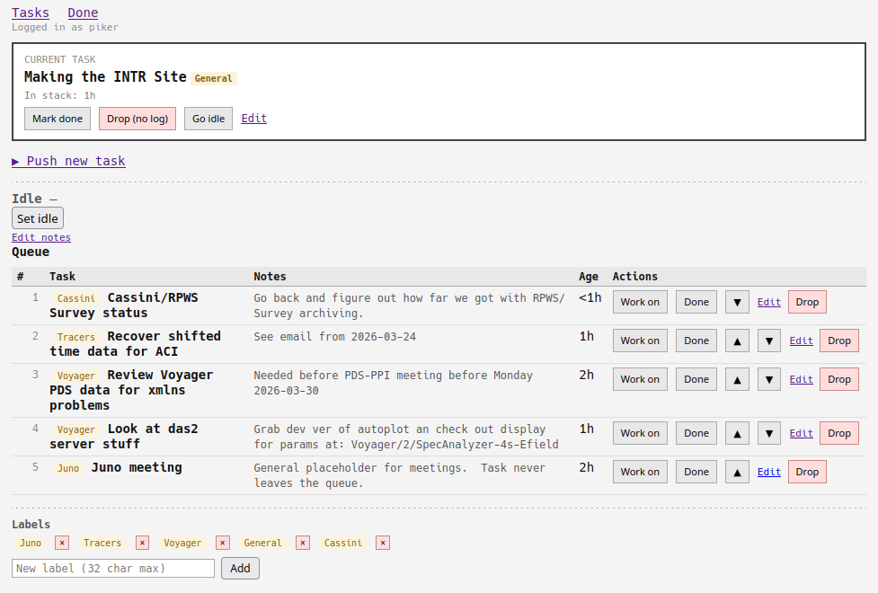

# INTR

A single-user task tracker for people with more work than time.  Named after
the interrupt request pin on the Intel 8088 — because *something* is always
driving that pin high.

The queue is priority-ordered top to bottom, but tasks don't have to be
handled in priority order.  You grab whatever makes sense to work on, and
the top slot shows what you're currently doing.  Finished tasks move to a
yearly done archive.  Co-workers can see your queue without logging in.
Only you can change anything.



## Try it out!

If you don't feel like deploying to Apache or any other host, just run
```bash
git clone git@github.com:cpiker/intr.git
cd intr
python3 serve.py  # Python 3.7 or higher
```
then open your browser to:
```
http://localhost:8088/intr
```
and let the task data pile up in the git working copy.  If you decide
you like it, deployment instructions follow.  You can copy the JSON files
from your home directory up to the server.

## Usage

### Task queue (tasks)

| Action | Description |
|--------|-------------|
| PUSH | Add a task at the top (becomes current), at position #2, or at the bottom |
| CALL | Grab any queued task &mdash; it becomes current, old current returns to top of queue |
| ▲ / ▼ | Nudge a task up or down in the queue without touching the current task |
| IRET | Completes the current task, logs it to `done_YYYY.json`, promotes the next queued task |
| IRET (from queue) | Complete a queued task without grabbing it first |
| Edit | Edit the name or notes of any task inline |
| STI HLT | Parks the current task back at the top of the queue, go Idle pending an interrupt |

All write actions require HTTP Basic Auth.  Read access is open.

### Done archive (done)

Completed tasks grouped by ISO calendar week, newest week first.  Columns:
task name, date completed, time spent in the stack.

A year selector appears automatically when more than one year's data is
present.  No cron job or manual action is needed at year-end &mdash; the scripts
detect the current year and create a new file automatically.

## Deployment

INTR is designed to run as a simple CGI application. For a departmental or
shared server, it is recommended to host the scripts in a segregated directory
with a dedicated subdirectory for data.

### 1\. File System Layout

Place the scripts in a directory accessible to the web server, and create a
`data` subdirectory that the web server user (e.g., `www-data` or `apache`)
can write to.

```
/path/to/application/
├── .htaccess
├── tasks
├── done
└── data/          # Must be writable by the web server
```

### 2\. Apache Configuration

The following describes a "trusted expert user" CGI configuration for a
multi-use Apache server.  This allows minimal central configuration while
enabling the trusted expert user to adjust configurations without restarting
the shared server.  All specific application settings are moved to a local
`.htaccess` file.  Replace "/usercgi" with the URL pattern you want to use,
and "/path/to/application" with the actual location.

```apache
# trusted user CGI
Alias /usercgi /path/to/application
<Directory "/path/to/application">
  AllowOverride FileInfo Options AuthConfig
  Require all denied
</Directory>
```

### 3\. Access Configuration

Moving all the important details to a local `.htaccess` file allows maximal
flexibility for the trusted expert user.  The following takes advantage
of the allowed overrides in the main Apache configuration and punches all
the necessary holes to allow only the required access.  Replace
"/path/to/application" with the actual location, and "192.168.1.0/24" with
whatever network address range is trusted.  The user should be admonished
not to provide access to anything unnecessary.

```apache
# Adjust /path/to/application everywhere below as appropriate
# /path/to/application/.htaccess

Options +ExecCGI

SetEnv INTR_TASKS_FILE "/path/to/application/data/tasks.json"
SetEnv INTR_DONE_DIR   "/path/to/application/data"

<FilesMatch "^(tasks|done)$">
  SetHandler cgi-script
  AuthType Basic
  AuthName "INTR Task Tracker"
  # Even better, feel free to put this one level up
  AuthUserFile "/path/to/application/.htpasswd"
  <RequireAll>
    # Adjust network address range as appropriate
    Require ip 127.0.0.1 192.168.1.0/24
    # Authorization logic
    <RequireAny>
      # Allow anonymous GET or HEAD
      Require expr "%{REQUEST_METHOD} in {'GET','HEAD'} && -z req('Authorization')"
      # Need valid-user for POST or already logged in
      Require valid-user
    </RequireAny>
  </RequireAll>
</FilesMatch>
```

**NOTE:** Since only the two (correctly spelled) scripts are explicitly
configured to be accessible, any typos will result in `403 Forbidden`
instead of `404 Not Found` errors.  There is potential for confusion here,
both on the part of users and people looking at Apache error logs.

### 4\. Permissions and Authentication

For modularity, these are described as being installed in
"/path/to/application" but for extra security the data directory and password
file may be elsewhere, perhaps in an adjacent directory.

1.  **Make the scripts executable:**

    ```bash
    cd /path/to/application
    chmod +x tasks done
    ```

2.  **Set data directory ownership:**

    ```bash
    chgrp www-data /path/to/application/data # or group apache
    chmod 2770 /path/to/application/data
    ```

3.  **Create the password file:**
    Store this file outside of the web-accessible document root.
    One level up from this example location is even better.
    Make sure the correct location is set in `.htaccess`.

    ```bash
    htpasswd -c /path/to/application/.htpasswd your_username
    ```

## Data Files

This example configures `/path/to/application/data`, however this could be
relocated as long as the `SetEnv` statements in `.htaccess` are adjusted.

All task data are contained in JSON files. This not the most efficent but
is easier then setting up an external RDBMS.  The example layout will look
similar to the following after data are entered.

```
/path/to/application/data/
    tasks.json          Current queue &mdash; auto-created on first write
    done_2026.json      Completed tasks for the year &mdash; auto-created
    done_2025.json      Previous years accumulate here automatically
    ...
```

At year-end, `done_YYYY.json` stays in place and a new file is created for
the incoming year.  The done page auto-detects all `done_*.json` files in the
data directory and shows a year selector when more than one is present.
Nothing needs to be done manually.

You don't have to configure the location of the banners. They are embedded 
as strings in the python code. They're only provided standalone for ease
of updates. Updating the images will do nothing on it's own, you'll have to
re-insert them into the CGI scripts to see any changes.

## Network and Security Notes

INTR is designed for use on a **trusted internal network**. While Basic Auth
protects write operations, the scripts do not implement CSRF protection.
Always host the application under HTTPS to protect credentials sent during the
login process.


**AI disclosure**
> This code was generated in cooperation with Claude, which is an Artificial 
> Intelligence service provided by Anthropic. Though design and development was
> orchestrated by a human, reviewed by a human and tested by a human, most of
> the actual code was composed by an AI.  The final operating configuration
> and code tweaks were suggested by Google/Gemini as well.
>
> It is completely reasonable to forbid AI generated software in some contexts.
> Please check the contribution guidelines of any projects you participate in.
> If the project has a rule against AI generated software then DO NOT INCLUDE
> THESE FILES, in whole or in part, in your patches or pull requests.

